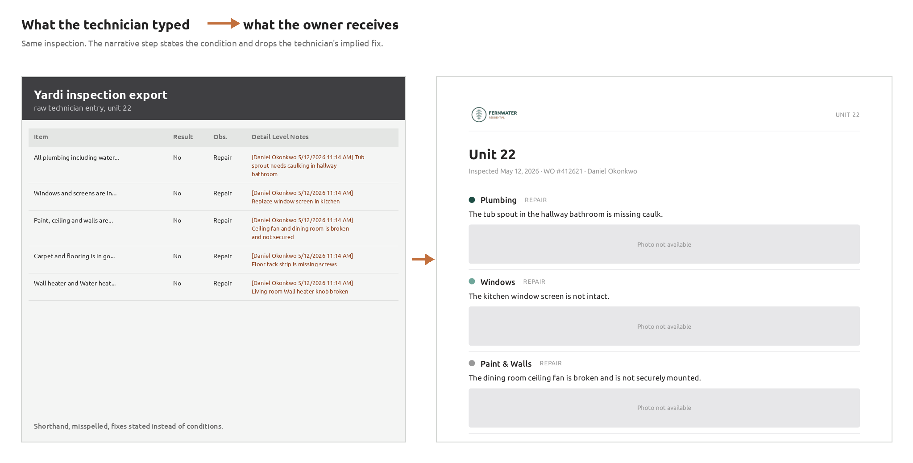

# Inspection Report Builder

Turns a raw property-management inspection export into an owner-ready PDF, rewriting rough field notes into clean, factual prose along the way.



*Left: what the maintenance technician typed on a phone in a unit. Right: the page the property owner receives.*

## The problem

Maintenance technicians walk every unit once a year and log what they find on a phone, fast and in shorthand. Real examples from a live export: *"Tub sprout needs caulking in hallway bathroom."* *"Ceiling fan and dining room is broken and not secured."* *"Garbage disposal not working Bathtub and bathroom sink need strainers."*

Property owners are investors. They get a PDF by email and judge the management company by how it reads. Somebody used to bridge that gap by hand, one unit at a time.

## Why I built it

I ran marketing and technology for a property management company operating 12,800 units. Our inspection software produced an export, not a report. Turning it into something an owner would actually read was manual work nobody had time for, so the polished version rarely happened.

This is the tool that closes that gap. It parses the export, pulls the embedded photos, builds the charts, rewrites each technician note into one clean factual sentence, and renders a branded PDF.

**It never shipped.** It was built, tested and retested against real portfolio exports across multiple properties, and revised once based on feedback from a property owner who reviewed the output. My position was eliminated before rollout. The code is here because the engineering is worth showing, not because it ever ran in production.

## The interesting part: it refuses to recommend anything

A property manager who writes "this should be replaced" has made a recommendation, and recommendations carry liability. The report states what the inspection **found**. The owner decides what to do about it.

That is enforced, not suggested. The narrative writer is forbidden from using *should*, *recommend*, *needs to be*, *we advise*, *warrants*, or *must*, and from claiming any work is scheduled or underway. Then `inspection-report check` runs that as a **QA gate and fails the build** if the language appears in the output.

So the tool converts a note like *"Carpet in bedrooms are old and damaged. Need to be replaced with hardwood floor"* into a statement of condition, dropping the technician's implied fix. That is the whole design constraint in one example.

## How it works

```
xlsx / pdf export
   ↓  parsers/          pull inspections, findings, embedded photos
   ↓  pipeline/photos   extract, downscale, recompress
   ↓  pipeline/charts   matplotlib, brand palette
   ↓  pipeline/narrative rewrite each note; assign High / Medium / Low
   ↓  render/           Jinja templates + CSS, printed by headless Chromium
   ↓  qa                size, structure, disclaimer, unit coverage, language gates
PDF
```

Every checklist item appears in the export with a Yes or No result, so a unit with no answered rows was never entered rather than one that passed. Holding on to that distinction is what lets the parser report those units as **Not Inspected** with the technician's reason, instead of silently folding them into "no action required," which is the failure mode that makes an owner stop trusting a report.

**No API key required.** Narratives are written by Claude inside a Claude Code or Cowork session through the bundled skill in `.claude/skills/`. The API path exists in the code as a dormant option and is off by default.

## Run it yourself

```bash
bash scripts/setup.sh                      # venv, deps, Chromium
.venv/bin/inspection-report build "sample-data/Prop 4820 - Inspection Report.xlsx"
```

The PDF lands in `outputs/`. A synthetic sample export ships in `sample-data/` so the whole thing runs from a clean clone with no real data. It carries embedded photographs, drawn from scratch and stamped `SAMPLE - SYNTHETIC DATA`, so the photo path runs end to end too: extraction from the workbook, anchor matching to the right finding, resampling, and filtering the signature pads back out.

Other commands:

```bash
inspection-report extract <file>    # dump findings JSON
inspection-report discover <file>   # parse and print, no render
inspection-report check <pdf>       # run the QA gates
```

The narratives behind `docs/example-report.pdf` ship alongside the sample, so the exact example rebuilds without a session:

```bash
.venv/bin/inspection-report build "sample-data/Prop 4820 - Inspection Report.xlsx" \
  --narratives sample-data/narratives.json
```

## Project structure

```
src/inspection_report/
  parsers/     xlsx and pdf ingestion
  pipeline/    photos, charts, narrative, priority
  render/      Jinja templates, CSS, Chromium
.claude/skills/ the build-inspection-report skill
assets/        fonts, logo, inspector roster
sample-data/   synthetic export, safe to run
```

## A note on the data

Everything in this repo is synthetic. The property, the units, the residents, the inspectors and their certification numbers, the addresses, the work order numbers and the photographs are all invented. The rough-note *style* in the sample is modelled on real technician writing, because that is the problem the tool exists to solve, but no real inspection data, resident information or client property appears anywhere in this repository or its history.

Built against Yardi's inspection export format. The parser is format-specific by necessity; the architecture is not.
